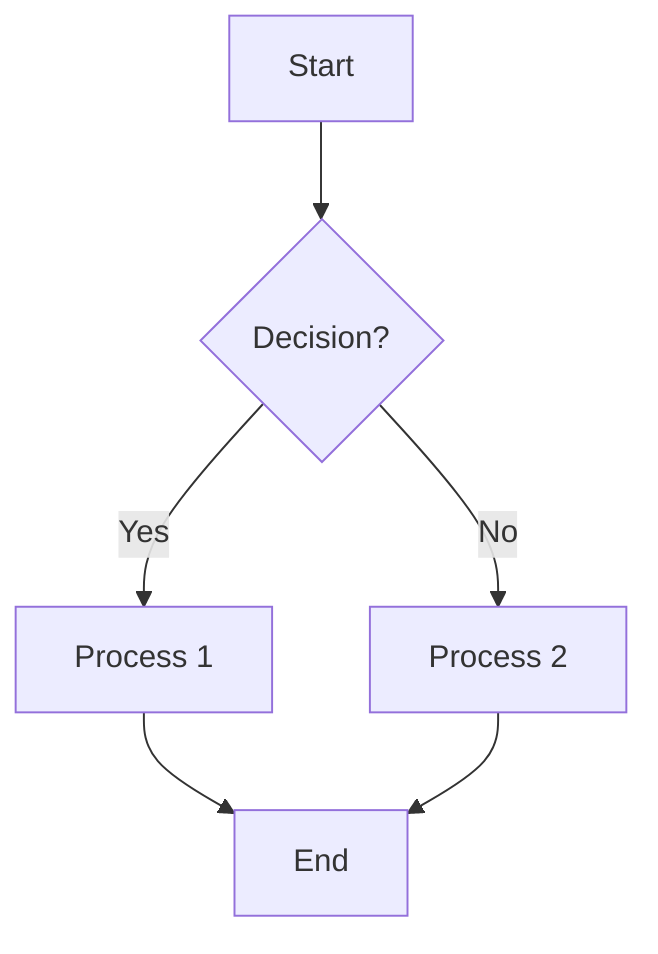
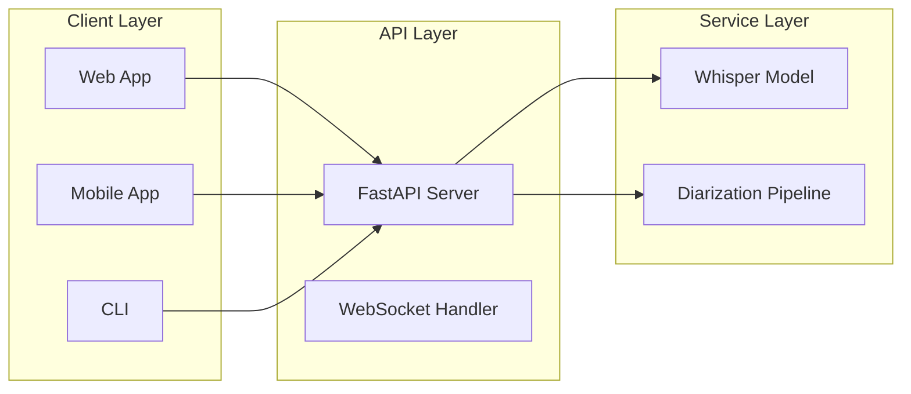
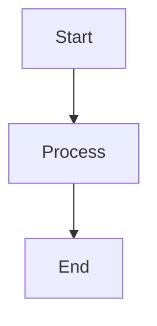
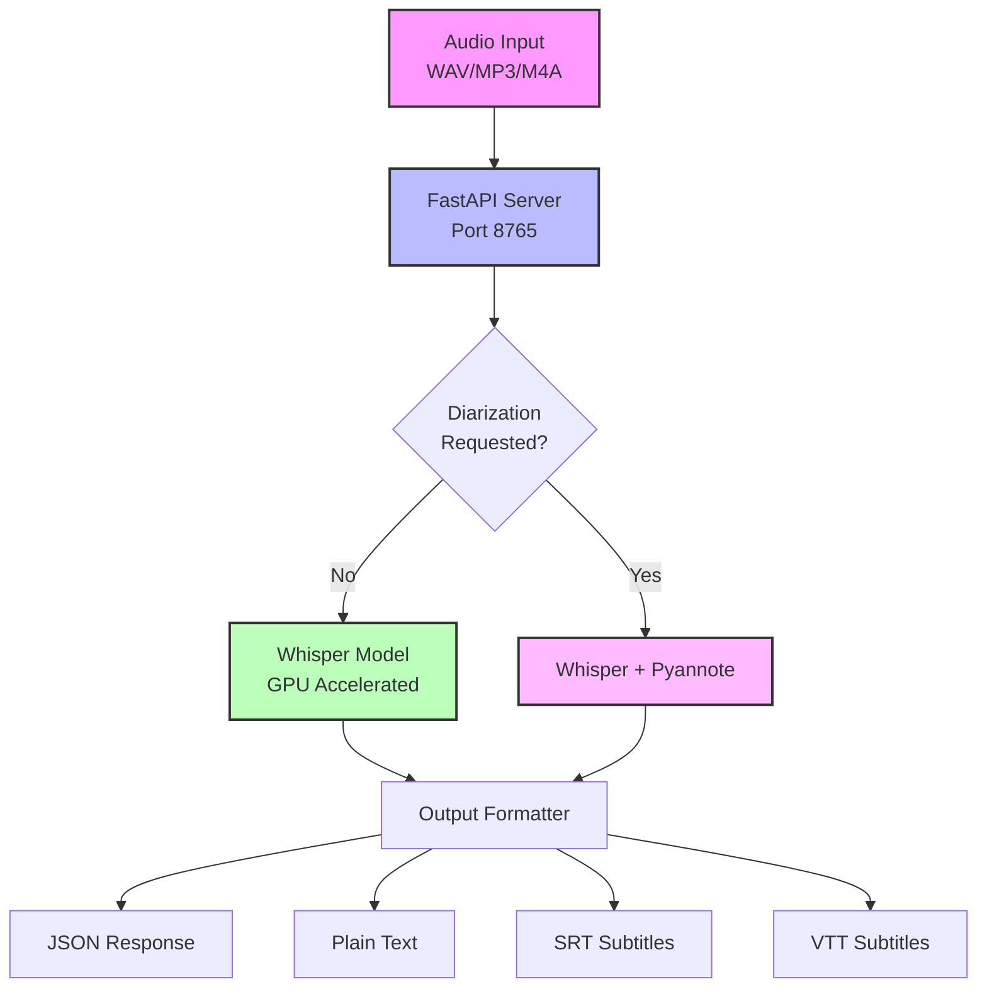
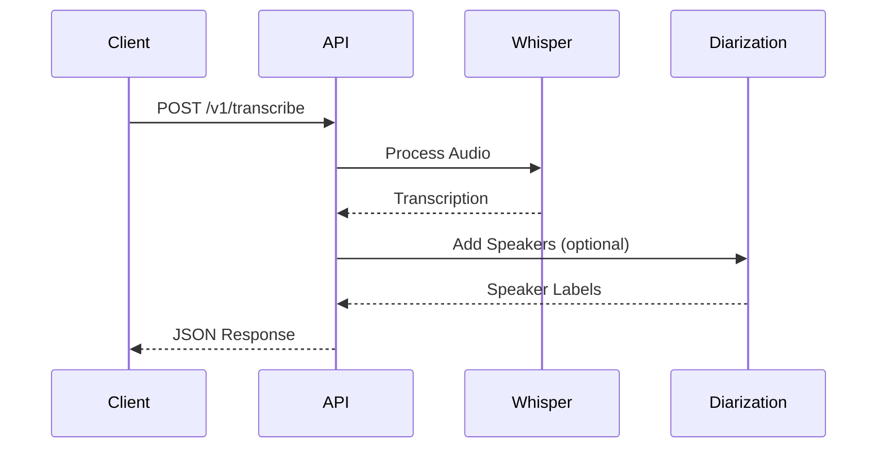
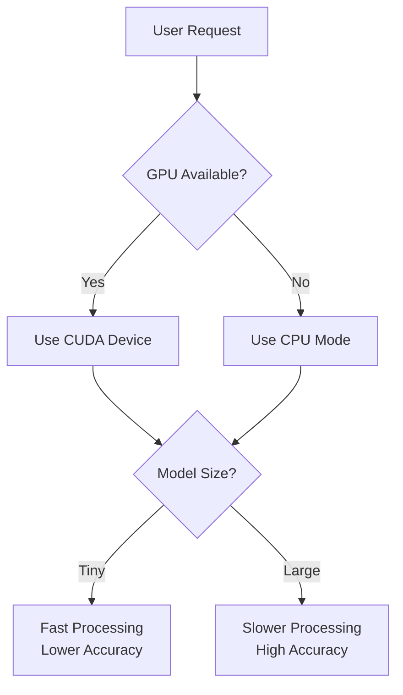

# Mermaid Diagrams in Markdown - Implementation Guide

## Overview
Mermaid is a JavaScript-based diagramming tool that renders text definitions to create diagrams dynamically in Markdown files. GitHub natively supports Mermaid rendering.

## Syntax Reference

### Flowchart (Most Common for Architecture)


### Key Syntax Elements
- **Nodes**: `A[Text]` creates a rectangle node
- **Shapes**: 
  - `A[Rectangle]`
  - `B{Diamond/Decision}`
  - `C((Circle))`
  - `D([Stadium shape])`
- **Arrows**: 
  - `-->` solid arrow
  - `-.->` dotted arrow
  - `==>` thick arrow
  - `--Text-->` labeled arrow

### Architecture Diagram Pattern


## Implementation in README.md

### Basic Structure
````markdown
## Architecture


````

### Complex System Architecture Example


## Best Practices

1. **Keep It Simple**: Start with basic shapes and connections
2. **Use Subgraphs**: Group related components
3. **Add Styling**: Use `style` commands for visual hierarchy
4. **Label Connections**: Add text on arrows for clarity
5. **Direction Matters**: Use TD (top-down), LR (left-right), etc.

## GitHub Rendering
- Wrap in triple backticks with `mermaid` language identifier
- GitHub automatically renders in README files
- Maximum size: Keep diagrams under 50 nodes for performance

## Common Patterns for API Documentation

### Request Flow


### Decision Tree


## Fallback for Non-Mermaid Environments

Always provide ASCII art alternative:
```
┌─────────────┐     ┌──────────────┐     ┌─────────────┐
│   Client    │────▶│  API Server  │────▶│   Output    │
└─────────────┘     └──────────────┘     └─────────────┘
```

## References
- Official Docs: https://mermaid.js.org/
- GitHub Support: https://github.blog/developer-skills/github/include-diagrams-markdown-files-mermaid/
- Live Editor: https://mermaid.live/