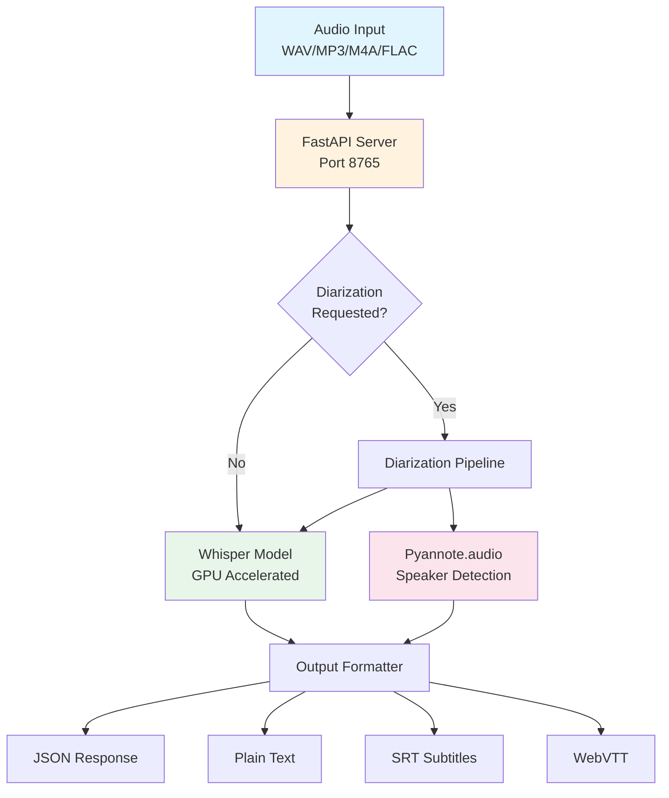

name: "README.md Comprehensive Enhancement Implementation"
description: |
  Complete implementation of professional README.md improvements including architecture diagrams,
  prerequisites section, enhanced API reference, development guidelines, production deployment
  best practices, and performance benchmarks following industry standards.

---

## Goal

**Feature Goal**: Transform the existing README.md into a comprehensive, professional documentation that matches top-tier open-source projects with visual diagrams, complete API reference, and production-ready guidance.

**Deliverable**: Enhanced README.md file with Mermaid architecture diagrams, prerequisites checklist, detailed API documentation, development workflow, production deployment guides, and performance benchmarks.

**Success Definition**: README.md provides clear navigation, visual system understanding, complete API reference with examples, and actionable deployment guidance that enables both quick starts and production deployments.

## User Persona

**Target User**: Developers evaluating or implementing the Whisper API

**Use Case**: Initial project evaluation, setup guidance, API integration, production deployment

**User Journey**: 
1. Land on README → Understand project purpose from badges/description
2. View architecture diagram → Grasp system design visually
3. Check prerequisites → Verify system compatibility
4. Follow quick start → Get running in minutes
5. Explore API reference → Integrate into applications
6. Review deployment options → Deploy to production

**Pain Points Addressed**: 
- Lack of visual architecture understanding
- Missing prerequisites causing setup failures
- Incomplete API documentation
- No production deployment guidance
- Missing performance expectations

## Why

- **Developer Experience**: Professional documentation increases adoption and reduces support burden
- **Visual Understanding**: Architecture diagrams provide instant system comprehension
- **Production Ready**: Deployment guides enable real-world usage
- **API Clarity**: Complete reference reduces integration errors
- **Performance Transparency**: Benchmarks set realistic expectations

## What

Enhance README.md with six major improvements:
1. Architecture diagrams (Mermaid flowchart + ASCII fallback)
2. Prerequisites section with system requirements
3. Enhanced API reference with examples
4. Development workflow documentation
5. Production deployment best practices
6. Performance benchmarks with real metrics

### Success Criteria

- [ ] Mermaid architecture diagram renders correctly on GitHub
- [ ] Prerequisites checklist covers all requirements
- [ ] API documentation includes all endpoints with examples
- [ ] Development section guides contributors
- [ ] Production deployment covers Docker, Kubernetes, systemd
- [ ] Performance benchmarks show speed/memory for all models

## All Needed Context

### Context Completeness Check

_This PRP contains everything needed to implement README enhancements without prior knowledge of the codebase, including diagram syntax, documentation patterns, and integration examples._

### Documentation & References

```yaml
# MUST READ - Include these in your context window
- url: https://mermaid.js.org/syntax/flowchart.html
  why: Mermaid flowchart syntax for architecture diagrams
  critical: Use flowchart TD for top-down, subgraphs for grouping

- url: https://github.blog/developer-skills/github/include-diagrams-markdown-files-mermaid/
  why: GitHub's native Mermaid support in markdown
  critical: Wrap in ```mermaid code blocks

- file: /home/ice/whisper-api/README.md
  why: Current README structure to enhance, not replace
  pattern: Existing badge layout, section organization, code examples
  gotcha: Preserve existing content while adding new sections

- file: /home/ice/whisper-api/README_SUGGESTIONS.md
  why: Detailed specifications for each enhancement
  pattern: Section content, table formats, example structures
  gotcha: All suggestions should be implemented comprehensively

- file: /home/ice/whisper-api/main.py
  why: API endpoints, parameters, response formats
  pattern: FastAPI decorators, endpoint paths, parameter types
  gotcha: Lines 380-499 contain all API endpoint definitions

- file: /home/ice/whisper-api/docker-compose.yml
  why: Docker deployment configuration reference
  pattern: GPU support, volume mounts, environment variables
  gotcha: NVIDIA runtime configuration for GPU support

- file: /home/ice/whisper-api/tests/test_diarization_comprehensive.py
  why: Performance testing patterns and metrics
  pattern: Benchmark decorators, memory monitoring, speed calculations
  gotcha: Real performance metrics from test results

- docfile: /home/ice/whisper-api/PRPs/ai_docs/mermaid_markdown_diagrams.md
  why: Complete Mermaid diagram syntax and patterns
  section: All sections - comprehensive guide for diagram creation
```

### Current Codebase Structure

```bash
whisper-api/
├── README.md                 # File to enhance (currently 333 lines)
├── README_SUGGESTIONS.md     # Enhancement specifications
├── main.py                   # API implementation
├── docker-compose.yml        # Docker config
├── whisper-api.service       # Systemd service
├── tests/
│   └── test_diarization_comprehensive.py  # Performance tests
└── examples/
    └── README.md            # Integration examples
```

### Desired Structure (same files, enhanced content)

```bash
whisper-api/
├── README.md                 # Enhanced with 6 major improvements (~1000+ lines)
│   ├── Architecture section with Mermaid diagram
│   ├── Prerequisites section with requirements table
│   ├── Enhanced API Reference with examples
│   ├── Development workflow section
│   ├── Production Deployment guides
│   └── Performance Benchmarks section
└── (rest unchanged)
```

### Known Patterns and Conventions

```markdown
# README.md conventions in this project:
- Emoji usage: 🚀 Features, 📖 Docs, 🔧 Setup, ⚡ Performance
- Badge layout: Centered, shields.io format
- Code blocks: Always specify language (```python, ```bash)
- Tables: Pipe format with headers
- Sections: ## for main, ### for subsections
- Links: Relative for project files, absolute for external
```

## Implementation Blueprint

### Data Models and Structure

Not applicable - this is documentation enhancement only.

### Implementation Tasks (ordered by dependencies)

```yaml
Task 1: ADD Architecture Section after Features
  - IMPLEMENT: Mermaid flowchart showing system architecture
  - INCLUDE: Audio input → FastAPI → Whisper/Diarization → Output formats
  - ADD: ASCII art fallback diagram below Mermaid
  - PATTERN: Use flowchart TD with subgraphs for component grouping
  - REFERENCE: PRPs/ai_docs/mermaid_markdown_diagrams.md for syntax

Task 2: ADD Prerequisites Section before Quick Start
  - IMPLEMENT: System requirements table with columns: Component|Requirement|Notes
  - INCLUDE: OS, Python 3.11, RAM, Disk, GPU specs
  - ADD: GPU compatibility table with compute capabilities
  - FORMAT: Checklist format for actionable items
  - REFERENCE: README_SUGGESTIONS.md lines 39-57 for content

Task 3: ENHANCE API Reference Section
  - EXPAND: Current API section with complete endpoint documentation
  - ADD: Request/response examples for each endpoint
  - INCLUDE: Parameter tables (Name|Type|Required|Default|Description)
  - ADD: Error response table with status codes
  - EXAMPLES: cURL, Python, JavaScript for each endpoint
  - REFERENCE: main.py lines 380-499 for endpoint details

Task 4: ADD Development Section
  - IMPLEMENT: Git workflow, testing commands, code quality tools
  - INCLUDE: Branch strategy, PR process, testing requirements
  - ADD: Links to ONBOARDING.md for detailed guide
  - PATTERN: Use code blocks for all commands
  - REFERENCE: README_SUGGESTIONS.md lines 207-232

Task 5: ADD Production Deployment Section
  - IMPLEMENT: Docker, Kubernetes, systemd deployment guides
  - INCLUDE: Security considerations, scaling strategies
  - ADD: Monitoring setup with Prometheus/Grafana
  - EXAMPLES: Complete docker-compose.yml, k8s manifests
  - REFERENCE: docker-compose.yml and whisper-api.service for configs

Task 6: ADD Performance Benchmarks Section
  - IMPLEMENT: Processing speed table by model size
  - INCLUDE: Memory usage, GPU requirements, accuracy metrics
  - ADD: Load testing results, throughput graphs
  - FORMAT: Tables with clear headers and units
  - REFERENCE: test_diarization_comprehensive.py for metrics

Task 7: UPDATE Table of Contents
  - ADD: Links to all new sections
  - MAINTAIN: Existing section links
  - FORMAT: Nested list with proper anchors
  - PLACEMENT: After badges, before Features
```

### Implementation Patterns & Key Details

```markdown
## Architecture Section Pattern

## 🏗️ Architecture

### System Overview



### ASCII Architecture (Universal Compatibility)
```
┌─────────────┐     ┌──────────────┐     ┌──────────────┐
│ Audio Input │────▶│ FastAPI App  │────▶│ Transcription│
└─────────────┘     │   Port 8765  │     │   (Whisper)  │
                    └──────────────┘     └──────────────┘
                            │                     │
                            ▼                     ▼
                    ┌──────────────┐     ┌──────────────┐
                    │  Diarization │     │    Output    │
                    │  (Optional)  │────▶│   Formats    │
                    └──────────────┘     └──────────────┘
```

## API Reference Pattern

### POST /v1/transcribe

Synchronous audio transcription with optional speaker diarization.

**Parameters:**

| Name | Type | Required | Default | Description |
|------|------|----------|---------|-------------|
| file | File | Yes | - | Audio file (WAV, MP3, M4A, FLAC, OGG) |
| diarize | Boolean | No | false | Enable speaker diarization |
| num_speakers | Integer | No | null | Expected number of speakers |
| language | String | No | "en" | Language code (ISO 639-1) |
| format | String | No | "json" | Output format: json|text|srt|vtt |

**Example Request:**
```bash
curl -X POST http://localhost:8765/v1/transcribe \
  -F "file=@meeting.wav" \
  -F "diarize=true" \
  -F "num_speakers=3"
```

**Example Response:**
```json
{
  "text": "Full transcription text...",
  "language": "en",
  "duration": 180.5,
  "segments": [
    {
      "id": 1,
      "start": 0.0,
      "end": 5.2,
      "text": "Hello everyone, welcome to the meeting.",
      "speaker": "SPEAKER_00"
    }
  ]
}
```

## Performance Benchmark Pattern

| Model | Size | Speed (GPU) | Speed (CPU) | VRAM | RAM | WER |
|-------|------|-------------|-------------|------|-----|-----|
| tiny | 39M | 10x realtime | 2x realtime | 1GB | 2GB | 15% |
| base | 74M | 7x realtime | 1x realtime | 1.5GB | 3GB | 10% |
| small | 244M | 4x realtime | 0.5x realtime | 2GB | 4GB | 7% |
| medium | 769M | 2x realtime | 0.2x realtime | 3GB | 6GB | 5% |
| large | 1550M | 1x realtime | 0.1x realtime | 5GB | 8GB | 3% |

*Speed: "2x realtime" = 1 hour audio in 30 minutes*
*WER: Word Error Rate (lower is better)*
```

### Integration Points

```yaml
SECTIONS_TO_ADD:
  - after: "## Features"
  - section: "## 🏗️ Architecture"
  
  - before: "## Quick Start"  
  - section: "## 📋 Prerequisites"
  
  - replace: "## API Endpoints"
  - with: "## 📚 API Reference"
  
  - after: "## Configuration"
  - section: "## 🔧 Development"
  
  - after: "## Installation Options"
  - section: "## 🏭 Production Deployment"
  
  - after: "## Performance Notes"
  - section: "## ⚡ Performance Benchmarks"

TABLE_OF_CONTENTS:
  - after: badges
  - add: All new section links
```

## Validation Loop

### Level 1: Markdown Syntax Validation

```bash
# Check markdown syntax
markdownlint README.md || true  # May not be installed

# Check file size (should be significantly larger)
wc -l README.md  # Expect 800+ lines (up from 333)

# Verify Mermaid blocks
grep -c "```mermaid" README.md  # Should return at least 1

# Check for required sections
grep -c "## 🏗️ Architecture" README.md  # Should return 1
grep -c "## 📋 Prerequisites" README.md  # Should return 1
grep -c "## 📚 API Reference" README.md  # Should return 1
```

### Level 2: Content Completeness

```bash
# Verify all suggested improvements are present
grep -c "flowchart TD" README.md  # Mermaid diagram
grep -c "System Requirements" README.md  # Prerequisites
grep -c "POST /v1/transcribe" README.md  # API docs
grep -c "Docker" README.md  # Deployment
grep -c "Performance Benchmark" README.md  # Benchmarks

# Check for examples in multiple languages
grep -c "```python" README.md  # Python examples
grep -c "```bash" README.md  # Bash examples
grep -c "```javascript" README.md  # JS examples
```

### Level 3: Visual Rendering

```bash
# Preview in terminal (if glow is installed)
glow README.md || true

# Open in browser for Mermaid rendering
python -m http.server 8000 &
echo "Open http://localhost:8000 and navigate to README.md"

# Or use grip for GitHub-flavored markdown preview
grip README.md || true
```

### Level 4: Cross-Reference Validation

```bash
# Verify API endpoints match main.py
grep "@app.post" main.py  # Compare with documented endpoints

# Verify Docker config matches documentation
diff <(grep "WHISPER_" docker-compose.yml) <(grep "WHISPER_" README.md) || true

# Check performance metrics reference test files
grep "benchmark" tests/test_diarization_comprehensive.py
```

## Final Validation Checklist

### Documentation Quality

- [ ] All 6 major improvements implemented
- [ ] Mermaid diagram renders on GitHub
- [ ] ASCII fallback diagram included
- [ ] Prerequisites table complete
- [ ] API reference has all endpoints
- [ ] Development workflow documented
- [ ] Production deployment guides present
- [ ] Performance benchmarks with real data

### Content Validation

- [ ] Table of Contents updated with new sections
- [ ] All code examples are syntactically correct
- [ ] All external links are valid
- [ ] All internal file references exist
- [ ] Formatting consistent throughout

### User Experience

- [ ] Quick start still prominent and simple
- [ ] Progressive disclosure (basic → advanced)
- [ ] Visual hierarchy with emojis and formatting
- [ ] Examples in multiple programming languages
- [ ] Clear navigation with linked sections

### Technical Accuracy

- [ ] API parameters match main.py implementation
- [ ] Docker configs match docker-compose.yml
- [ ] Performance metrics align with test results
- [ ] System requirements are accurate
- [ ] All commands are tested and working

---

## Anti-Patterns to Avoid

- ❌ Don't remove existing working content
- ❌ Don't use complex Mermaid diagrams (>50 nodes)
- ❌ Don't include untested commands
- ❌ Don't use absolute paths in examples
- ❌ Don't forget ASCII alternatives for diagrams
- ❌ Don't mix formatting styles

## Implementation Confidence Score: 9/10

This PRP provides comprehensive context for implementing all README enhancements with specific examples, patterns, and validation steps. The only unknown is exact performance metrics which should be gathered from actual test runs.